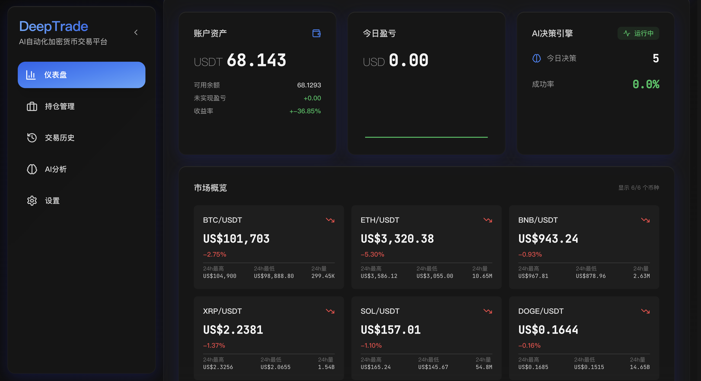
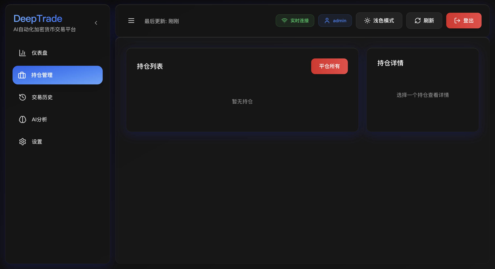
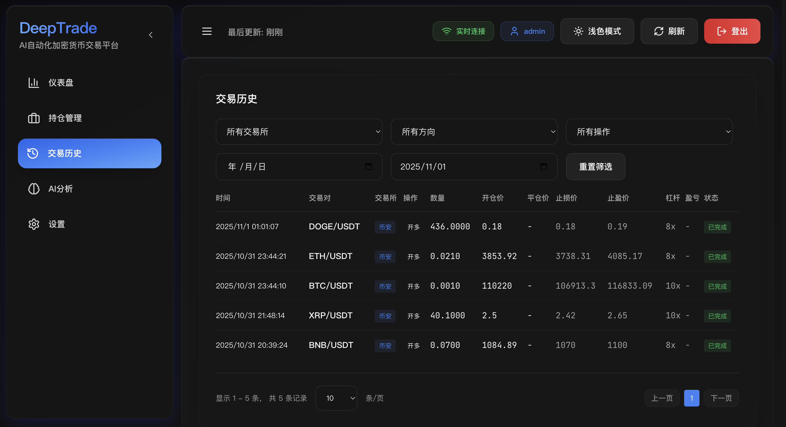
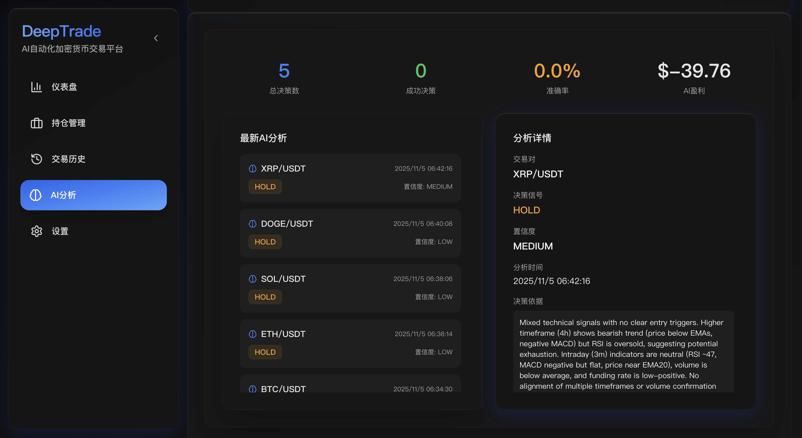
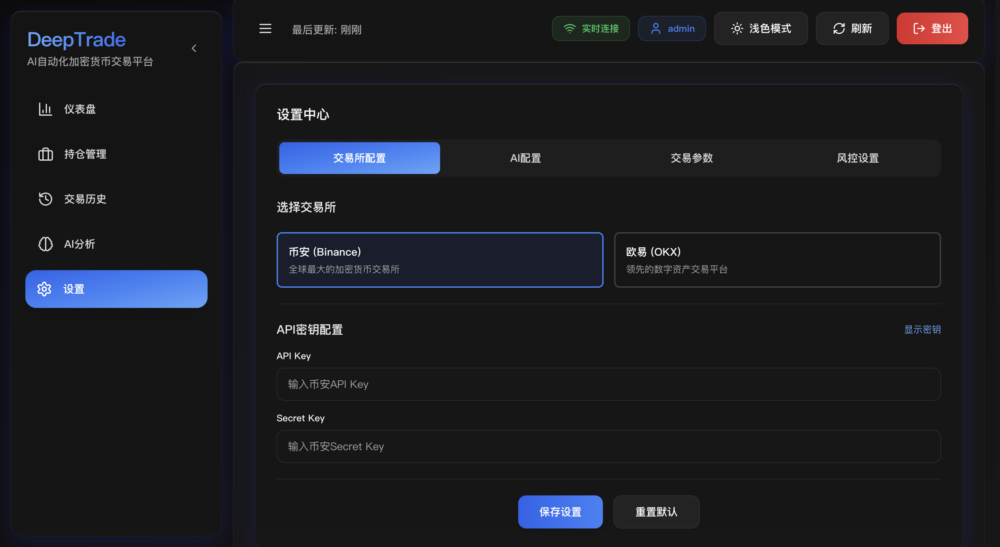

<div align="center">
  
  <h1>DeepTrade - AI驱动的加密货币实盘交易系统</h1>
  <p>基于大模型AI的实时加密货币交易系统 | 实盘数据驱动 | 5层风控保护</p>


</div>

## 🎯 项目简介

DeepTrade是一个基于大模型AI的**实盘加密货币交易系统**，灵感来源于nof1的Alpha Arena大模型炒币竞赛。系统直接对接币安实盘市场，利用DeepSeek大模型进行实时市场分析，通过5层风控机制实现自动化智能决策交易。

**⚠️ 重要提示：这是一个实盘交易系统，涉及真实资金风险。请在充分测试后谨慎使用。**

## ✨ 核心特性

### 1. 实盘交易 - 真实市场数据驱动
- **非模拟交易**：直接对接币安现货/期货市场，使用真实资金交易
- **实时决策**：大模型基于真实市场数据做出投资决策
- **透明度**：所有交易数据、盈亏情况完全透明展示

### 2. 币安官方WebSocket - 毫秒级数据延迟
- **官方数据源**：直连币安期货WebSocket API `wss://fstream.binance.com/ws/`
- **实时推送**：1000ms更新频率，价格变动毫秒级响应
- **数据缓存**：30秒智能缓存，REST API仅作fallback备援
- **自动重连**：网络异常自动恢复，最多重试30次
- **性能提升**：相比传统轮询方式，API调用减少95%+

### 3. DeepSeek大模型集成 - AI市场分析
- **模型支持**：集成DeepSeek Chat API（OpenAI兼容格式）
- **智能提示词**：参考Alpha Arena竞赛提示词，优化市场分析能力
- **多时间框架**：3分钟、15分钟、4小时综合分析
- **决策统计**：实时追踪AI决策准确率、胜率、夏普比率

### 4. 5层风控机制 - 全方位风险防护

#### 第一层：失效条件风控（Invalidation Condition）
- 价格突破关键支撑/阻力位时立即止损
- 防止趋势判断错误导致的重大亏损

#### 第二层：趋势冲突风控（Trend Conflict）
- 监控15分钟与4小时趋势一致性
- 发现背离时自动平仓

#### 第三层：AI智能止损（AI Stop-Loss）
- 大模型基于市场情绪动态调整止损位
- 比固定止损更智能的损失控制

#### 第四层：AI动态止盈（AI Take-Profit）
- AI识别最佳获利时机
- 智能锁定利润，避免回吐

#### 第五层：传统固定止损（Traditional Stop-Loss）
- 兜底保护，默认5%最大亏损
- 独立于AI判断的硬性风控

### 5. 自动化交易引擎 - 无人值守
- **定时分析**：每3分钟自动执行市场分析
- **智能下单**：符合条件时自动开仓
- **实时监控**：风险监控每30秒检查持仓状态
- **自动平仓**：触发风控条件时立即执行

## 🏗️ 技术架构

### 整体架构

```
┌─────────────────────────────────────────────────────────┐
│                     Frontend (React + TS)                │
│  ┌─────────────┐ ┌─────────────┐ ┌─────────────┐         │
│  │  Dashboard  │ │  Positions  │ │   History   │         │
│  └─────────────┘ └─────────────┘ └─────────────┘         │
│  ┌─────────────┐ ┌─────────────┐                         │
│  │  Analysis   │ │  Settings   │                         │
│  └─────────────┘ └─────────────┘                         │
└─────────────────────┬───────────────────────────────────┘
                      │ WebSocket + REST API
┌─────────────────────┴───────────────────────────────────┐
│                    Backend (Node.js)                    │
│  ┌─────────────────────┐ ┌─────────────────────────────┐ │
│  │   Trading Engine    │ │    Risk Monitor (30s)       │ │
│  │   - AI Analysis     │ │    - TP/SL Check            │ │
│  │   - Position Mgmt   │ │    - Auto Close             │ │
│  │   - Order Execute   │ └─────────────────────────────┘ │
│  └─────────────────────┘                                │
│  ┌─────────────────────┐ ┌─────────────────────────────┐ │
│  │  Binance WebSocket  │ │      REST API               │ │
│  │  - Ticker Stream    │ │  - Account Info             │ │
│  │  - Order Updates    │ │  - Trade History            │ │
│  │  - 1000ms Refresh   │ │  - Config Updates           │ │
│  └─────────────────────┘ └─────────────────────────────┘ │
│  ┌─────────────────────────────────────────────────────┐ │
│  │               Database (SQLite)                     │ │
│  │  - Positions  - Trade Logs  - AI Signals           │ │
│  │  - Performance Stats                               │ │
│  └─────────────────────────────────────────────────────┘ │
└─────────────────────┬───────────────────────────────────┘
                      │
┌─────────────────────┴───────────────────────────────────┐
│                External Services                         │
│  ┌─────────────────┐  ┌────────────────────┐            │
│  │   Binance API   │  │  DeepSeek API      │            │
│  │  - Futures      │  │  - Chat Completions│            │
│  │  - Spot         │  │  - Market Analysis │            │
│  └─────────────────┘  └────────────────────┘            │
└─────────────────────────────────────────────────────────┘
```

### 前端技术栈
- **React 18** + **TypeScript** - 现代化UI框架
- **Vite** - 极速构建工具
- **TailwindCSS** - 实用优先的CSS框架（液态玻璃设计风格）
- **Zustand** - 轻量级状态管理
- **Recharts** - 数据可视化图表
- **Axios** - HTTP客户端
- **WebSocket** - 实时数据推送

### 后端技术栈
- **Node.js 18+** - JavaScript运行时
- **Express** - Web应用框架
- **SQLite (better-sqlite3)** - 嵌入式数据库
- **Winston** - 结构化日志系统
- **CCXT** - 加密货币交易所接口库
- **node-cron** - 定时任务调度
- **WebSocket** - 实时通信

### 核心技术组件

#### 1. TradingEngine.js（交易引擎核心）
- 每3分钟执行AI分析
- 多时间框架综合判断
- 自动开仓平仓逻辑
- 风险监控集成

#### 2. TickerWebSocket.js（实时数据）
- 币安官方WebSocket连接
- ticker数据流订阅
- 自动重连机制
- 数据缓存管理

#### 3. RiskMonitor.js（风险监控）
- 每30秒检查持仓
- TP/SL条件判断
- 快速止损止盈
- 并发安全处理

#### 4. AIAnalysis.js（AI分析）
- DeepSeek API调用
- 市场数据封装
- 决策结果解析
- 准确率统计

## 🚀 快速开始

### 前置要求
- Node.js ≥ 18.0.0
- npm ≥ 8.0.0
- 币安API密钥（现货+期货权限）
- DeepSeek API密钥

### 1. 克隆项目
```bash
git clone https://github.com/jj5437/deeptrade.git
cd deeptrade
```

### 2. 后端配置

```bash
cd backend
npm install
cp .env.example .env
```

编辑 `.env` 文件：
```env
# AI配置
AI_MODEL=deepseek
DEEPSEEK_API_KEY=your_deepseek_api_key
AI_BASE_URL=https://api.deepseek.com

# 交易所配置
EXCHANGE_TYPE=binance
BINANCE_API_KEY=your_binance_api_key
BINANCE_SECRET=your_binance_secret

# 交易配置
AUTO_TRADE=false  # ⚠️ 测试阶段必须设为false
LEVERAGE=10
TRADE_AMOUNT=10
TRADING_TIMEFRAME=3m
```

启动后端：
```bash
npm run dev
```

### 3. 前端配置

```bash
cd frontend
npm install
cp .env.example .env
```

编辑 `.env` 文件：
```env
VITE_API_URL=http://localhost:8080/api
VITE_WS_URL=ws://localhost:8080/ws
VITE_DEFAULT_THEME=dark
```

启动前端：
```bash
npm run dev
```

### 4. 访问应用

- 前端地址：http://localhost:5437
- 后端API：http://localhost:8080/api

## 📱 界面预览

### 仪表盘（Dashboard）
- 实时总资产展示
- PnL盈亏统计
- AI决策状态
- 市场概览
- 最近交易记录



### 持仓管理（Positions）
- 实时持仓价格
- PnL计算
- 一键平仓
- AI建议展示
- 风控状态



### 交易历史（History）
- 完整交易记录
- 盈亏分析
- 胜率统计
- 筛选排序


### AI分析（Analysis）
- 决策准确率
- 胜率统计
- 夏普比率
- 信号分析


### 系统设置（Settings）
- 交易参数配置
- 主题切换
- API密钥管理
- 风控阈值调整


## 📊 核心功能详解

### 实时数据流架构

```
币安WebSocket ───► TickerWebSocket ───► 缓存 ───► 交易引擎
     ↓                ↓              ↓         ↓
  价格推送      数据验证       30秒缓存    AI分析
     ↓                ↓              ↓         ↓
  前端WebSocket ───► REST API ───► 数据库 ───► 交易执行
```

**关键优势：**
- 数据延迟 < 1秒
- API调用减少95%
- 网络错误自动恢复
- 前端实时更新

### 风控机制流程

```
开仓 ──► AI分析 ──► 趋势验证 ──► 失效条件检查 ──► 持仓中
           │              │               │
           ├─► 风险过高 ──► 拒绝开仓        │
           └──► 设置AI止损/止盈 ──────────────┘
                      │
持仓监控 ──► RiskMonitor（30秒间隔）───► 检查TP/SL
                      │
                      ├─► 触发止盈 ──► 自动平仓
                      ├─► 触发止损 ──► 自动平仓
                      └─► 趋势背离 ──► 自动平仓
```

## 📈 性能监控

### 系统指标
- **AI决策准确率**：实时追踪AI预测成功率
- **胜率统计**：按交易对、信号类型统计
- **夏普比率**：风险调整后收益评估
- **最大回撤**：历史最大亏损幅度
- **盈亏比**：平均盈利/平均亏损

### 日志系统

```
logs/
├── system_YYYYMMDD_HH.log    # 系统运行日志
└── api_YYYYMMDD_HH.log     # API调用日志
```

- 日志每小时轮转
- 自动保留7天
- 支持按级别过滤
- 结构化JSON格式

## 🧪 测试建议

### 1. 模拟测试
```bash
# 设置为模拟模式，测试分析和决策，不自动执行交易
AUTO_TRADE=false
```

### 2. 实盘测试
```bash
# 小额资金测试
TRADE_AMOUNT=5
LEVERAGE=5
```

### 3. 压力测试
```bash
# 验证风险监控
# 连续观察30分钟，确认每30秒执行一次风险检查
tail -f logs/system_*.log | grep 风险检查
```

## 🚢 部署指南

### 方式一：Docker一键部署（推荐）

使用Docker Compose实现前后端 + Nginx反向代理的一键部署，支持HTTPS配置。

#### 前置要求
- Docker ≥ 20.0.0
- Docker Compose ≥ 2.0.0
- 域名（生产环境推荐）

#### 快速部署

1. **克隆项目并配置**
```bash
git clone https://github.com/jj5437/deeptrade.git
cd deeptrade
```

2. **配置环境变量**
```bash
# 复制环境变量模板
cp .env.example .env

# 编辑配置文件
vim .env
# 设置您的域名和端口

# 配置后端API密钥
cp backend/.env.example backend/.env
vim backend/.env
# 填入DeepSeek API密钥和交易所API密钥

# 配置前端（可选）
cp frontend/.env.example frontend/.env
```

3. **一键部署**
```bash
# 使用部署脚本
./deploy.sh

# 或手动部署
docker-compose up -d
```

4. **验证部署**
```bash
# 查看服务状态
./deploy.sh status

# 查看日志
./deploy.sh logs
```

5. **访问应用**
- 前端地址：http://localhost:80
- API地址：http://localhost:80/api
- WebSocket：ws://localhost:80/ws

#### 常用管理命令

```bash
# 部署服务
./deploy.sh

# 查看日志
./deploy.sh logs

# 停止服务
./deploy.sh stop

# 重启服务
./deploy.sh restart

# 重新部署
./deploy.sh redeploy

# 查看状态
./deploy.sh status

# 清理数据（危险操作）
./deploy.sh clean
```

#### 配置HTTPS（生产环境）

详细步骤请参考：[nginx/ssl/README.md](nginx/ssl/README.md)

快速配置：
```bash
# 1. 获取SSL证书（Let's Encrypt）
sudo certbot certonly --standalone -d your-domain.com

# 2. 复制证书到项目目录
sudo cp /etc/letsencrypt/live/your-domain.com/fullchain.pem ./nginx/ssl/cert.pem
sudo cp /etc/letsencrypt/live/your-domain.com/privkey.pem ./nginx/ssl/key.pem

# 3. 编辑 .env 启用HTTPS
echo "ENABLE_HTTPS=true" >> .env

# 4. 更新nginx配置中的域名
vim nginx/nginx.conf
# 将 your-domain.com 替换为实际域名

# 5. 重启服务
./deploy.sh restart
```

#### 目录结构

```
deeptrade/
├── docker-compose.yml      # Docker Compose配置
├── deploy.sh              # 一键部署脚本
├── .env                    # 全局环境变量
├── .env.example           # 环境变量模板
├── nginx/                 # Nginx配置
│   ├── nginx.conf         # 反向代理配置
│   └── ssl/              # SSL证书目录
│       ├── cert.pem      # 证书文件
│       ├── key.pem       # 私钥文件
│       └── README.md     # SSL配置说明
├── backend/
│   ├── .env              # 后端环境变量
│   └── Dockerfile        # 后端镜像构建文件
└── frontend/
    ├── .env              # 前端环境变量
    └── Dockerfile        # 前端镜像构建文件
```

#### Docker架构

```
┌─────────────────────────────────────┐
│            Nginx (Port 80/443)      │
│        反向代理 + SSL + 负载均衡       │
└──────────────┬──────────────────────┘
               │
       ┌───────┴───────┐
       │               │
┌──────▼──────┐  ┌─────▼──────┐
│  Frontend   │  │  Backend   │
│   (React)   │  │ (Node.js)  │
│   Port: 80  │  │  Port:8080 │
└─────────────┘  └────────────┘
                      │
               ┌──────▼──────┐
               │  SQLite DB  │
               │  (Volume)   │
               └─────────────┘
```

#### 故障排除

**问题1：端口被占用**
```bash
# 方案1：修改 .env 中的端口配置
NGINX_HTTP_PORT=8080

# 方案2：停止占用端口的进程
lsof -ti:80 | xargs kill
```

**问题2：后端启动失败**
```bash
# 查看后端日志
./deploy.sh logs backend

# 检查后端环境变量
docker-compose exec backend cat backend/.env
```

**问题3：前端无法访问后端**
```bash
# 检查网络连接
docker network ls
docker-compose exec frontend wget -q http://backend:8080/health

# 检查nginx配置
docker-compose exec nginx nginx -t
```

**问题4：数据库权限错误**
```bash
# 修复数据目录权限
sudo chown -R 1001:1001 backend/data
```

### 方式二：PM2部署

```bash
# 安装PM2
npm install -g pm2

# 启动后端
cd backend && pm2 start src/index.js --name "deeptrade-backend"

# 启动前端
cd frontend && pm2 start npm --name "deeptrade-frontend" -- run preview

# 查看状态
pm2 status
```

## 📦 项目结构

```
deeptrade/
├── backend/                 # Node.js后端
│   ├── src/
│   │   ├── config/         # 配置管理
│   │   ├── controllers/    # 控制器
│   │   │   ├── ai/         # AI分析
│   │   │   ├── exchange/   # 交易所接口
│   │   │   ├── position/   # 持仓管理
│   │   │   ├── risk/       # 风险管理
│   │   │   └── ...
│   │   ├── services/       # 核心服务
│   │   │   └── TradingEngine.js
│   │   ├── routes/         # API路由
│   │   ├── server.js       # Express服务器
│   │   └── index.js        # 应用入口
│   ├── data/               # SQLite数据库
│   ├── logs/               # 日志文件
│   └── docs/               # 后端文档
│
├── frontend/               # React前端
│   ├── src/
│   │   ├── components/     # React组件
│   │   ├── pages/          # 页面组件
│   │   ├── stores/         # 状态管理
│   │   ├── services/       # API服务
│   │   ├── hooks/          # 自定义钩子
│   │   ├── types/          # TypeScript类型
│   │   └── utils/          # 工具函数
│   └── public/             # 静态资源
│
├── docs/                   # 项目文档
│   └── screenshots/        # 界面截图
│
└── README.md              # 项目说明
```

## 🔐 安全注意事项

1. **API密钥安全**
   - 绝不提交`.env`文件到Git
   - 使用环境变量存储敏感信息
   - 定期轮换API密钥

2. **交易安全**
   - 首次使用务必设置`AUTO_TRADE=false`
   - 从小资金开始测试
   - 密切关注风险日志

3. **系统安全**
   - 启用HTTPS（生产环境）
   - 配置防火墙规则
   - 定期备份数据库

4. **网络安全**
   - 限制API访问IP
   - 使用强密码
   - 启用双重认证

## 📝 TODO & 路线图

### 短期计划（1-2周）

- [ ] **OKX交易所支持**
  - 实现CCXT OKX集成
  - 测试OKX WebSocket连接
  - 添加OKX配置选项

- [ ] **前端配置界面完善**
  - 动态交易所选择（币安/OKX）
  - 实时配置更新（无需重启）
  - 交易参数可视化调整

### 中期计划（1个月）

- [ ] **其他大模型支持**
  - Claude API集成
  - GPT-4集成
  - 模型切换配置

- [ ] **Docker一键部署**
  - 前后端Docker Compose
  - 环境变量模板化
  - 一键启动脚本

- [ ] **性能优化**
  - 数据库索引优化
  - WebSocket连接池
  - 内存使用优化

### 长期计划（3个月）

- [ ] **更多交易所**
  - Bybit支持
  - Bitget支持
  - 跨交易所套利

- [ ] **高级交易策略**
  - 网格交易
  - DCA策略
  - 期权交易

- [ ] **机器学习增强**
  - 自定义技术指标
  - 模型训练功能
  - 回测系统

- [ ] **移动端支持**
  - React Native
  - 移动端推送通知
  - 远程控制

## 🤝 贡献指南

欢迎提交Issue和Pull Request！

### 开发流程
1. Fork项目
2. 创建特性分支
3. 提交变更
4. 创建Pull Request

### 代码规范
- ESLint + Prettier格式化
- TypeScript严格模式
- 提交信息遵循[Conventional Commits](https://www.conventionalcommits.org/)

## 📄 许可证

MIT License - 详见 [LICENSE](LICENSE) 文件

## ⚠️ 免责声明

1. **高风险投资**：加密货币交易存在极高风险，可能导致全部资金损失
2. **实盘交易**：本系统使用真实资金进行交易，非模拟环境
3. **无盈利保证**：过往表现不代表未来收益，不保证盈利
4. **用户自担风险**：使用者需充分了解风险，谨慎决策
5. **仅供学习**：本项目主要用于学习交流，不构成投资建议

使用前请务必：
- 充分测试
- 理解风险
- 从小资金开始
- 持续监控

## 📞 支持与联系

- 📧 邮箱：jj20235437@gmail.com
- 💬 讨论区：[GitHub Discussions](https://github.com/jj5437/deeptrade/discussions)
- 🐛 问题反馈：[GitHub Issues](https://github.com/jj5437/deeptrade/issues)

## 🙏 致谢

- [Alpha Arena](https://nof1.ai/leaderboard) - 项目灵感来源
- [Binance API](https://developers.binance.com/docs/zh-CN/binance-spot-api-docs) - 交易接口
- [DeepSeek](https://www.deepseek.com/) - AI模型服务
- [CCXT](https://github.com/ccxt/ccxt) - 交易所抽象层
- 开源社区的支持与贡献

---

**⭐ 如果这个项目对你有帮助，请给它一个星标！**

Made with ❤️ by jj5437
