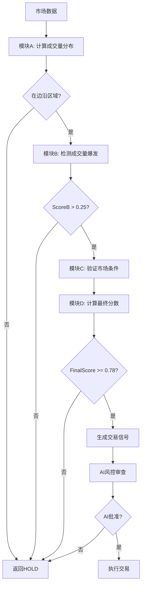

# 成交量动态正态分布策略实施文档

## 概述

本策略基于 `norm_policy.txt` 实现，采用"混合智能系统"架构：
- **计算逻辑层**：成交量分析策略（模块A-D）
- **AI决策层**：DeepSeek AI 风控审查

## 参数调整说明（2分钟 → 3分钟K线）

由于币安WebSocket API不支持2分钟K线，仅支持1分钟和3分钟，我们选择**3分钟K线**作为实施周期。

### 调整原理

3分钟K线相比2分钟：
- 时间跨度增加 50%
- 成交量聚合更多，波动相对较小
- 需要适当降低敏感度阈值以保持策略有效性

### 具体参数调整

| 参数 | 原值(2分钟) | 新值(3分钟) | 调整比例 | 说明 |
|------|------------|------------|---------|------|
| K线数量 | 720根 | 720根 | 不变 | 保持36小时历史数据 |
| 窗口阈值 | 30%峰值 | 30%峰值 | 不变 | 保持窗口识别一致性 |
| 边沿范围 | 前后3根 | 前后4根 | +33% | 适应更长时间周期 |
| 价值区 | 70%成交量 | 70%成交量 | 不变 | 保持核心定义 |

#### 模块B参数（成交量爆发检测）

| 参数 | 原值 | 新值 | 调整理由 |
|------|------|------|---------|
| P1_WEIGHT | 0.25 | 0.25 | 不变（位置判断） |
| P2_LOCAL_Z | 2.3 | 2.3 | 不变（局部标准差） |
| P3_GLOBAL_Z | 2.0 | 2.0 | 不变（全局标准差） |
| P4_VOLUME_RATIO | 2.2 | **2.0** | -9% - 3分钟波动更大 |
| P5_MA5_RATIO | 1.9 | **1.8** | -5% - 同理降低敏感度 |
| P6_DIST_STRENGTH | 1.3 | 1.3 | 不变 |
| P7_CONTINUATION | 0.6 | 0.6 | 不变 |

#### 模块C参数（市场条件验证）

| 参数 | 原值 | 新值 | 调整理由 |
|------|------|------|---------|
| ORDERBOOK_RATIO_LONG | 2.8 | 2.8 | 不变（订单簿比率） |
| ORDERBOOK_RATIO_SHORT | 0.35 | 0.35 | 不变 |
| DELTA_THRESHOLD_LONG | 800 | **1200** | +50% - 按时间周期调整 |
| DELTA_THRESHOLD_SHORT | -800 | **-1200** | +50% - 同上 |
| FUNDING_RATE_LONG | -0.0001 | -0.0001 | 不变 |
| FUNDING_RATE_SHORT | 0.0003 | 0.0003 | 不变 |

#### 模块D参数（决策融合）

| 参数 | 原值 | 新值 | 说明 |
|------|------|------|------|
| SCORE_B_STRONG | 0.80 | 0.80 | 强信号阈值 |
| SCORE_C_STRONG | 0.75 | 0.75 | 强验证阈值 |
| SCORE_C_LIGHT | 0.50 | 0.50 | 轻验证阈值 |
| FINAL_SCORE_THRESHOLD | 0.78 | 0.78 | 最终决策阈值 |
| WEIGHT_B | 0.6 | 0.6 | 成交量权重 |
| WEIGHT_C | 0.4 | 0.4 | 市场权重 |

## 策略工作流程



## 止损止盈设置

基于 AlphaArena 风控原则：
- **止损 (SL)**: 0.6% - 严格风控
- **止盈 (TP)**: 1.2% - 保持2:1风报比
- **杠杆**: 10x

计算公式：
```javascript
// 做多
stopLoss = currentPrice * (1 - 0.006)
takeProfit = currentPrice * (1 + 0.012)

// 做空
stopLoss = currentPrice * (1 + 0.006)
takeProfit = currentPrice * (1 - 0.012)
```

## AI风控审查规则

AI作为"首席风险官"，执行以下审查：

1. **评分一致性**: Score_B 和 Score_C 差值不能超过 0.5
2. **轻仓否决**: 任何 "LIGHT" 建议一律否决
3. **趋势匹配**:
   - 上升趋势 (Trending_Up) → 只做多
   - 下降趋势 (Trending_Down) → 只做空
   - 震荡市场 (Ranging) → 双向
4. **最终评分**: Final_Score 必须 >= 0.78

## 市场状态判断

基于4小时K线：
```
if (ADX > 20):
    if (EMA20 > EMA50): Trending_Up
    if (EMA20 < EMA50): Trending_Down
else:
    Ranging
```

## 实施细节

### 文件结构

```
backend/src/controllers/
├── strategy/
│   └── VolumeProfileStrategy.js  # 成交量策略核心
└── ai/
    └── AIAnalysis.js              # AI分析（已修改）
```

### 关键类和方法

#### VolumeProfileStrategy

```javascript
// 完整分析流程
analyze(symbol, currentPrice)

// 模块A: 成交量分布
calculateVolumeProfile(symbol)

// 模块B: 成交量爆发
detectVolumeSpike(symbol, volumeProfile, currentKline, previousKlines)

// 模块C: 市场验证
verifyMarketConditions(symbol, direction)

// 模块D: 融合决策
makeFinalDecision(symbol, scoreB, scoreC, direction, currentPrice)
```

#### AIAnalysis (修改后)

```javascript
// 混合智能分析
analyzeWithAI(priceData, priceHistory, signalHistory)

// 市场状态判断
determineMarketState(symbol)

// AI风控审查
performAIRiskReview(reviewPackage)
```

## 配置开关

在 `AIAnalysis.js` 中：
```javascript
this.useVolumeStrategy = true;  // 启用成交量策略
```

设置为 `false` 可回退到原有的 AlphaArena 提示词模式。

## 数据要求

1. **K线数据**: 720根3分钟K线（36小时）
2. **订单簿**: 至少20档买卖盘
3. **资金费率**: 实时资金费率
4. **技术指标**: 
   - 3分钟: EMA20, MACD, RSI, ATR, ADX
   - 4小时: EMA20, EMA50, ADX

## 性能考虑

### 计算复杂度
- 模块A: O(n) - n=720，线性扫描
- 模块B: O(1) - 常数时间检查
- 模块C: O(1) - API调用
- 模块D: O(1) - 简单计算

### API调用
- 每次分析约5-7个API调用
- 建议分析间隔: 3分钟（与K线周期同步）

### 缓存策略
- K线数据: 可缓存5分钟
- 订单簿: 实时获取
- 资金费率: 可缓存2分钟

## 回测准备

为后续回测开发，策略已预留以下接口：

1. **历史数据回放**: 可用历史K线数据模拟
2. **决策记录**: 所有Score和决策原因已记录
3. **性能指标**: 可计算胜率、盈亏比、最大回撤

回测模块建议结构：
```
backend/src/backtest/
├── BacktestEngine.js      # 回测引擎
├── HistoricalDataLoader.js # 历史数据加载
└── PerformanceMetrics.js   # 性能指标计算
```

## 日志和监控

策略运行时会输出详细日志：
```
[模块A] 开始计算成交量分布...
[模块A] 主峰位置: 索引=450, 成交量=1234.56
[模块A] 计算完成: VAH=50123.45, VAL=49876.54, VPOC=50000.00
[模块B] P1通过: 位于下边沿，得分+0.25
[模块B] P2通过: 局部Z值=2.45, 得分+0.20
...
[模块D] ✅ 决策: STRONG_LONG, 信号=BUY, 置信度=HIGH
🛡️ AI风控审查: BTC/USDT
🛡️ AI风控决策: APPROVE - High scores consistent with ranging market
✅ BTC/USDT AI批准交易: BUY (信心: HIGH)
```

## 风险提示

1. **回测验证**: 策略未经实盘验证，建议先进行充分回测
2. **参数优化**: 当前参数基于理论调整，可能需要根据实盘数据优化
3. **市场适应性**: 策略在不同市场状态下表现可能差异较大
4. **AI依赖**: 风控层依赖AI模型，需确保API稳定性

## 下一步计划

1. ✅ 策略实现完成
2. ✅ AI集成完成
3. ⏳ 回测系统开发
4. ⏳ 参数优化
5. ⏳ 实盘小额测试
6. ⏳ 性能监控和报告

## 参考文档

- `norm_policy.txt` - 原始策略文档
- `binance_websoket_interface.txt` - 币安API文档
- `CLAUDE.md` - 项目架构说明


